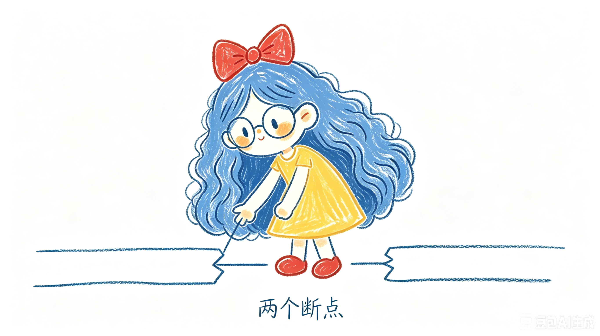
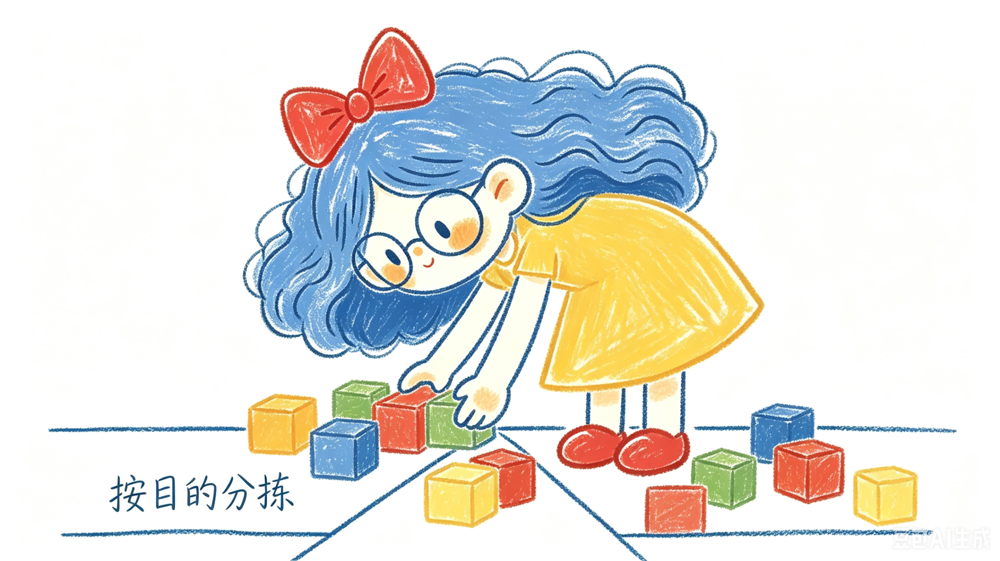
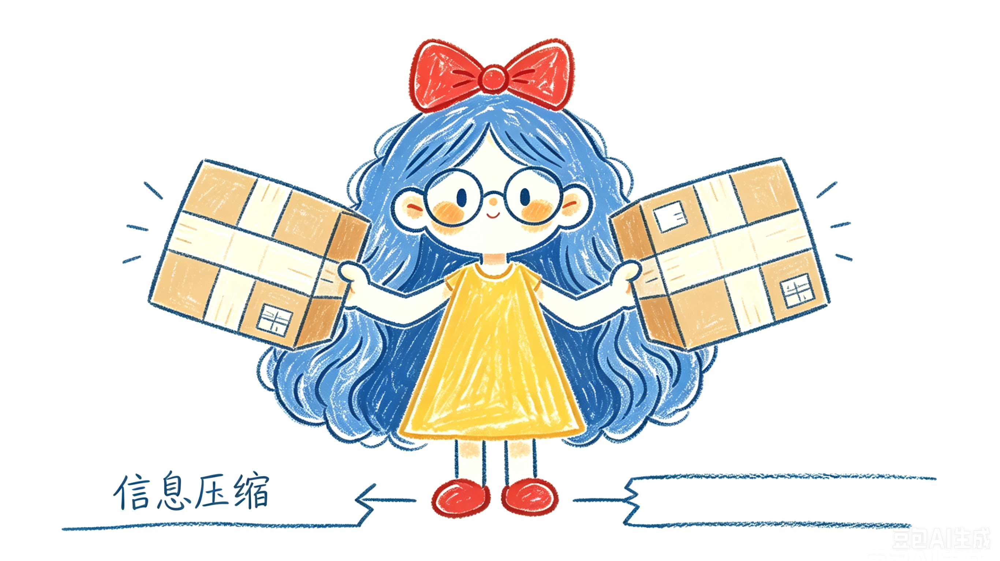
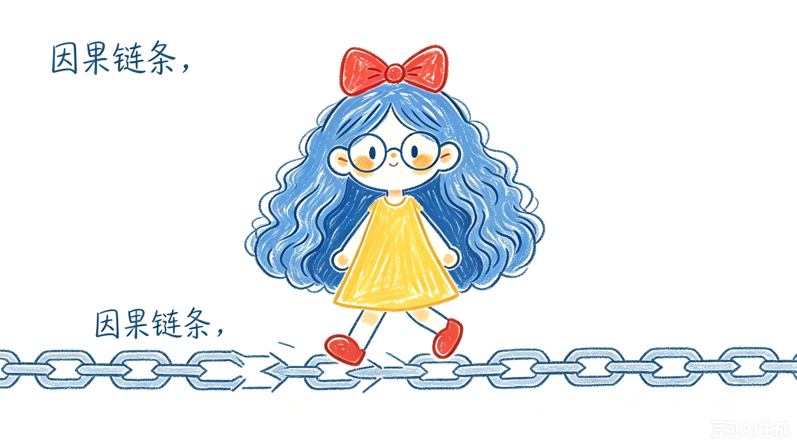
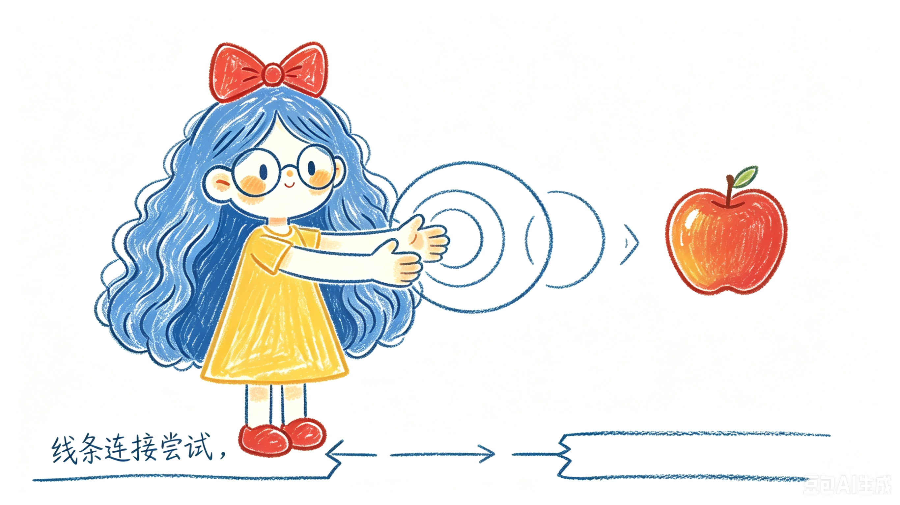
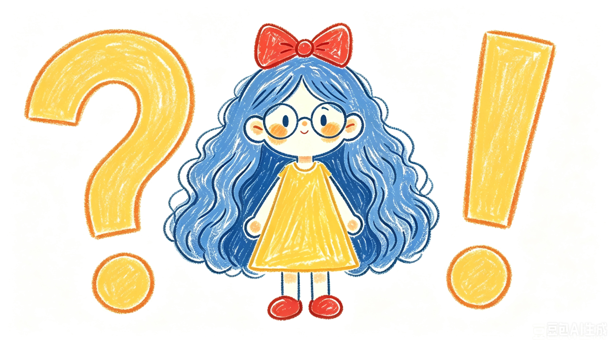
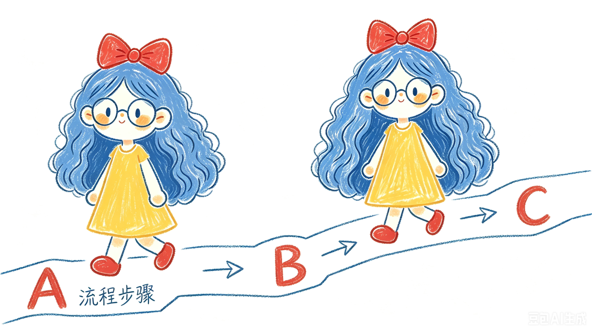
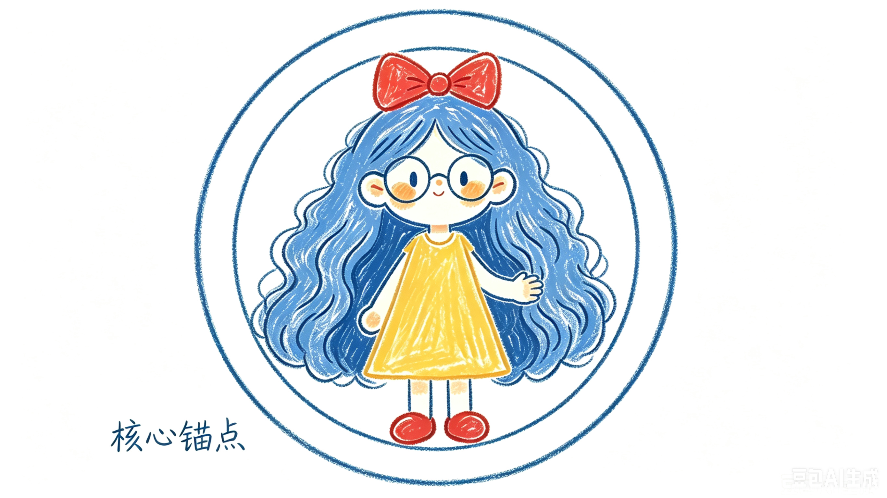

# 不二 Illustrations
不二的专属插画技能

## 项目介绍
默认视觉 IP 是「不二」：一个 Q 版二头身的软萌女孩。蓝色蓬松长波浪卷发（饱和中等蓝，发量厚重，中大卷，长度垂至腰部）、头顶一个硕大的红色蝴蝶结、大圆框眼镜、豆豆眼（实心深海军蓝）、圆脸带橘粉色腮红、黄色圆领短袖连衣裙（A字裙摆）、红色圆头鞋。
采用蜡笔/马克笔手绘纹理风格，所有色块内有可见的斜线笔触。适合用于知识讲解、逻辑演示、文章正文配图。

## 视觉规范
- 比例：16:9 横版
- 背景：纯白色
- 风格：蜡笔/马克笔纹理填充，深蓝色粗描边，手绘晃动线条
- 角色：不二必须作为核心主角，参与画面动作
- 填充：所有色块必须有手绘笔触纹理，不允许纯色平涂
- 批注：蓝色或红色简约手写中文标注

## 示例插画

